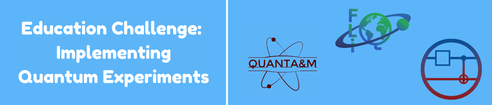

---
## Requirements

* Python 3.x
* Qiskit
* Matplotlib
* IBMQ Account setup (for running on real hardware)

```bash
pip install qiskit matplotlib qiskit_aer qiskit_runtime
```

---

## Files

* `double_slit_experiment.ipynb`: Main Jupyter notebook containing code, visualizations, and results.

---

# Quantum Coalition Future Leaders in Quantum (QC-FLIQ) Virtual Hackathon


# Young's Double Slit Experiment

## Overview

This project simulates **Young’s Double Slit Experiment** through  **quantum computing** using **Qiskit**. The notebook walks through the Young's Double slit concept, formulates a quantum equivalent, and demonstrates its implementation on both simulators and real quantum hardware.

---

## Objectives

* Understand the **Young's double slit experiment** and its routcomes.
* Model the **quantum equivalent** of the experiment using quantum circuits.
* Simulate the quantum circuit using:

  * **Qiskit AER simulator**
  * **Real IBM quantum hardware**
* Explore the potential quantum setup for **detecting which slit a particle passes through**.

---

## What I Did

1. **Understanding How Double Slit work**:

   * Reviewed the double slit experiment and wave interference principles.
   * Implemented a simple classical simulation of interference patterns.

2. **Quantum Circuit Modeling**:

   * Developed a quantum circuit that mimics the double slit setup using Hadamard and phase gates.
   * Incorporated mathematical analogs and quantum state evolution to mirror the classical phenomena.

3. **Equivalent Circuit Formulation**:

   * Mapped the quantum operations to equivalent quantum states.
   * Highlighted how quantum superposition and interference arise in the circuit.

4. **Simulation**:

   * Ran the quantum circuit on Qiskit’s **AER simulator** to validate the interference pattern.
   * Extended the implementation to **Real IBM quantum hardware**

---

