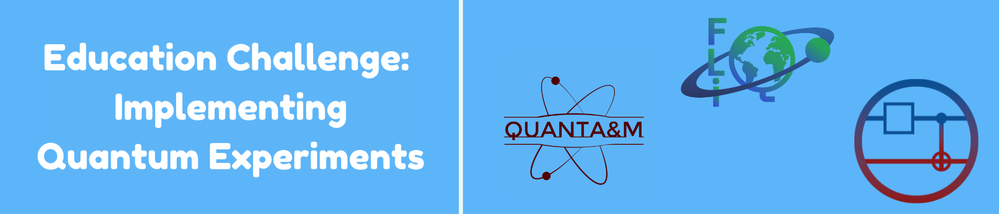

# Quantum Coalition Future Leaders in Quantum (QC-FLIQ) Virtual Hackathon
Instructions for IBM Quantum's education challenge in collaboration with QuantA&M for the 2025 QC-FLIQ Hackathon.

## Table of Contents
- [Challenge Prompt](#challenge-Prompt)
- [Submission](#Submission)
- [Resources](#Resources)
- [Qiskit Set-up](#Qiskit-Set-up)

## Challenge Prompt
Select one of the following:

1) Build and test a quantum random number generator using Hadamard gates.
2) Simulate a quantum double-slit experiment using quantum circuits.
3) Create all four Bell states using basic quantum gates, and verify them with measurement statistics.
4) Design a quantum dice (6-sided) using multiple qubits and validate fairness using Born’s rule.
5) Modify the modular exponentiation circuit to factor a different semi-prime.

## Submission

Your submission should be a well-documented Jupyter Notebook (.ipynb) containing all your code, explanations, and results.

[Submission Instructions](Instructions.ipynb)

## Resources

## Qiskit Set up
Qiskit installation and IBMQ access: [Installation](Installation.ipynb)

Notebook provided by the Penn Quantum Computing Club

